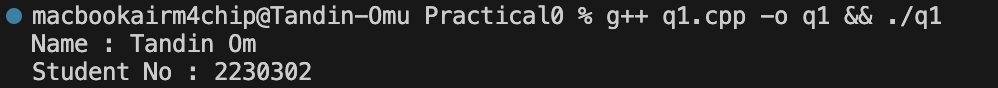
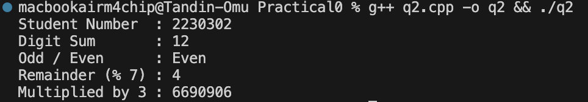
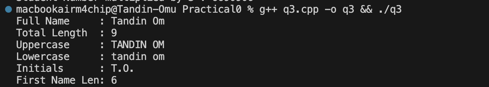
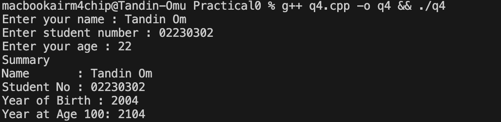
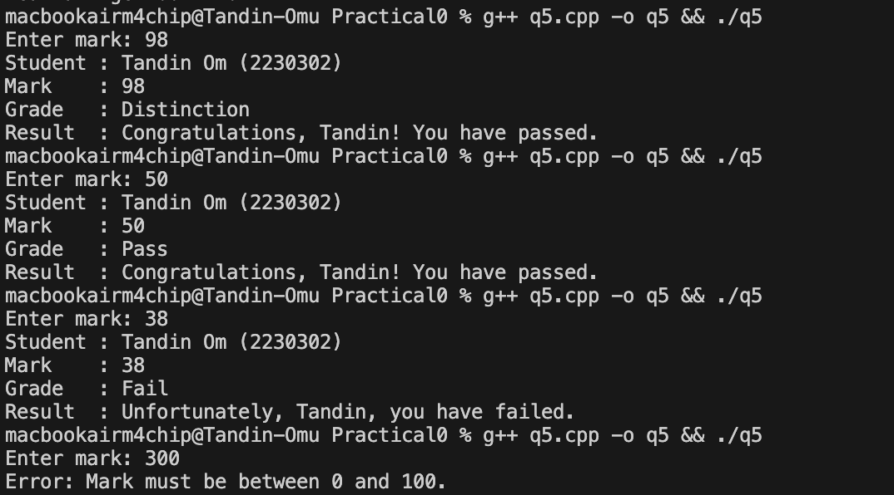
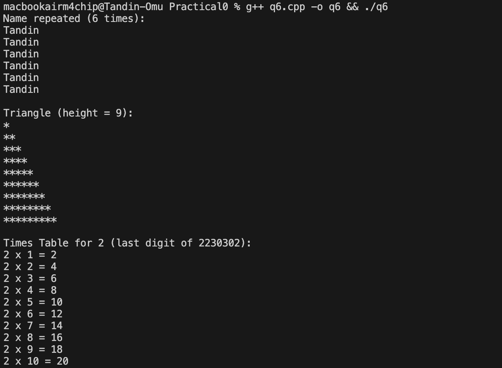
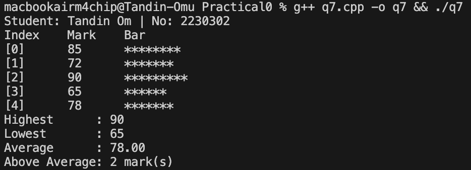
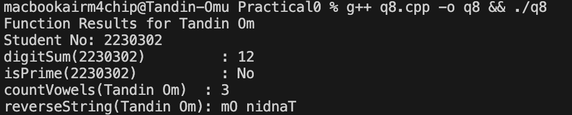
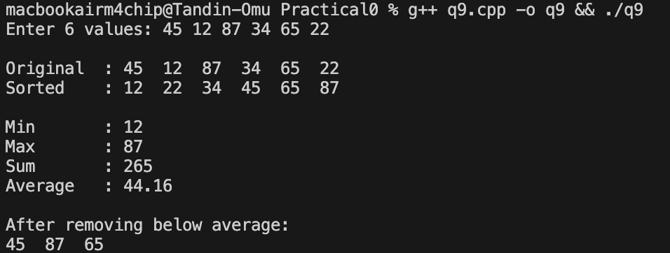
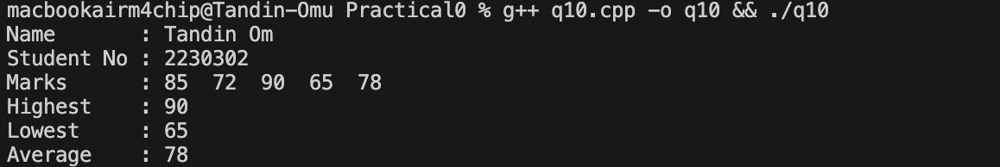

# C++ Programming Practical 

---

## Overview

A set of programming practice problems of programming concepts such as output, object-oriented programming, and more.

---

## Q01 — Personal Introduction Output

Variables are declared and defined in order to hold the name and student number. A formatted output of the student profile is then displayed using cout statements.

---

## Q02 — Arithmetic with Student Number

Basic arithmetic operations are carried out on the student number. The sum of the digits in the number is found by using a while loop. It is then checked for odd/even number, remainder when divided by 7, and multiplication by 3.

---

## Q03 — String Manipulation & Analysis

A string representing the full name is analyzed in order to display the total length, uppercase and lowercase versions, initials, and the length of the first name.

---

## Q04 — User Input & Type Conversion

The user is requested to enter the name, student number, and age at run time. The year of birth and the year when the student would turn 100 are then calculated and displayed.

---

## Q05 — Conditional Grade Classification

The input by the user is classified using if-else statements, whether it is a Distinction, Merit, Pass, or Fail grade. Validation is performed to ensure that the input is within the range 0-100.

---

## Q06 — Loop-Based Pattern Generation

Three values are generated using loops: the repetition of a name, a triangle using a nested loop, and a multiplication table for the last digit of the student’s ID.

---

## Q07 — Array Operations & Statistics

An integer array is created with 5 hardcoded values, each displayed along with their position in the array and a * bar. The highest, lowest, average, and count of values greater than the average are calculated and displayed.

---

## Q08 — Function Design & Modular Programming

Four functions are created: digitSum(), isPrime(), countVowels(), and reverseString(). Each function is invoked in main() using the student ID or full name, and results are displayed in a formatted summary.

---

## Q09 — Vector & Dynamic Collections

A vector is created to store 6 numbers entered by the user.The original and sorted contents are displayed, followed by the minimum, maximum, sum, and average. Values below the average are removed and the final vector is displayed.

---

## Q10 — Classes & Object-Oriented Design

 A Student class is created with details and public functions: `addMark()`, `getAverage()`, `getHighest()`, `getLowest()`, and `printReport()`. In the part of the program a Student object is created.5 marks are added to the Student object.The full academic report is printed.

